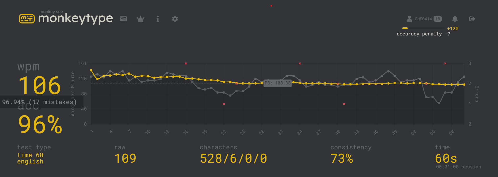

# Typing

## What I love about typing.

I just love the satisfying rhythm of my fingers flying across the keys, the deep mechanical clicking sound of my keyboard, allowing me to convey thoughts and ideas quickly and efficiently. Not only this, I find that typing is a very practical skill that allows me to get an edge when participating in writing tests.

:::note
The speed's were conducted on https://monkeytype.com/.

## How fast can I type?

My highest WPM is around 108 wpm within 60 seconds but I normally average around 102. What's yours?

## Fastest times table

| Time      | 15 seconds | 30 seconds | 60 seconds |
| --------- | ---------- | ---------- | ---------- |
| Best Time | 128 WPM    | 109 wpm    | 108 wpm    |
| Average   | 110 WPM    | 120 wpm    | 99 wpm     |
