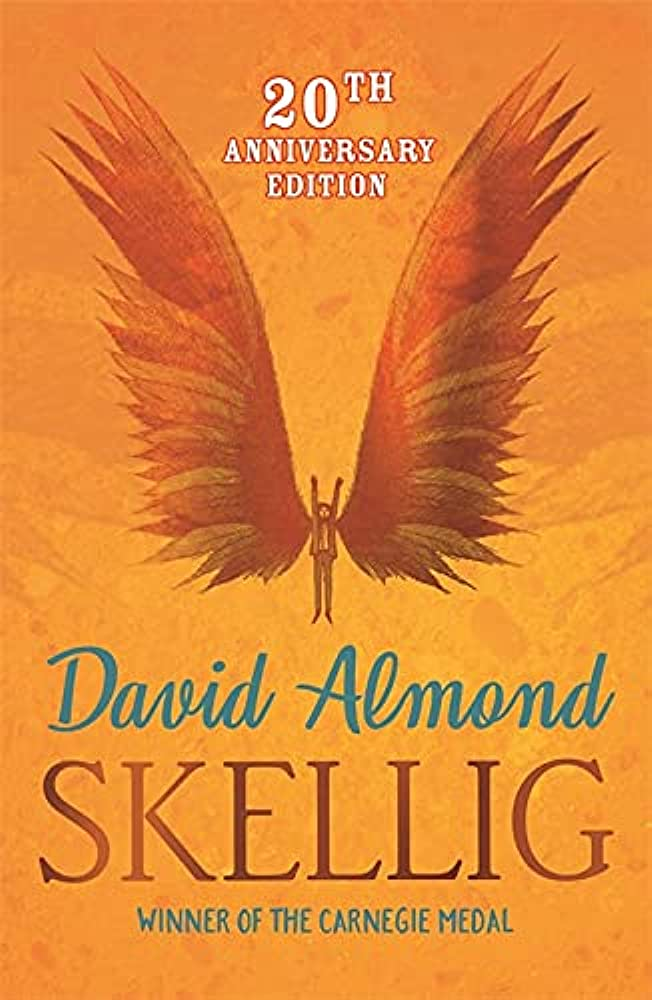

# Reading

## Reading

I find that reading resonates well with me. I love immersing myself in a good book and being able to escape into a world of wonder. I can seemingly get lost into that world and meet new people, explore new places and experience life in a different time.
It's a great way to pass time and learn about how other's feelingings.

## Most Memerable Book and Series

My most memerable book would be a book called 'Skellig'. It's truly a book that will keep you turning the page.

I find that it is hard to decide my favourite series , but I think the series of 'Wings of Fire' and 'Skulldugery Pleasent' were great stories that I read in primary school. I feel that those books were engaging and I personnaly love these series.

